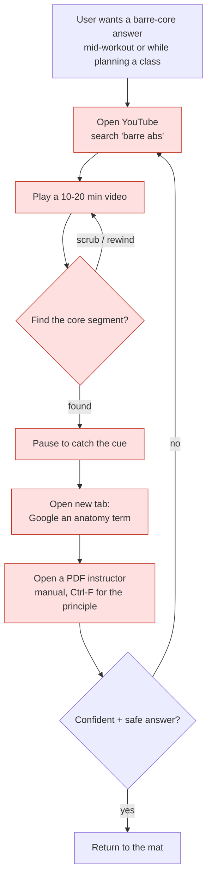
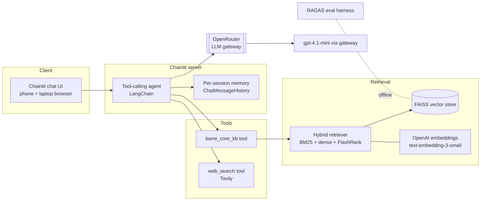
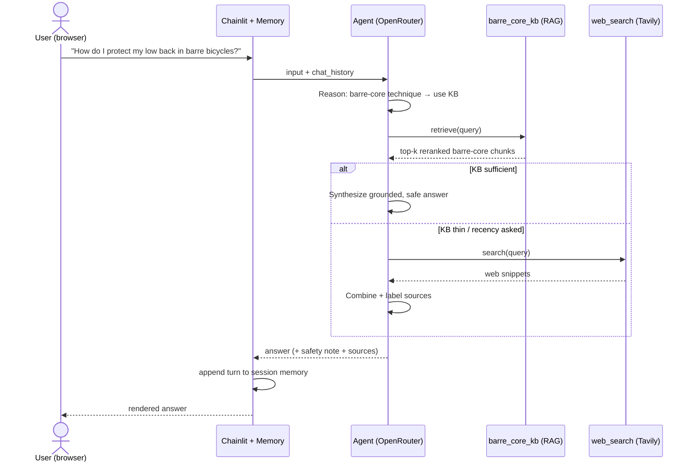

# Barre Core Coach — Certification Challenge Submission

**An Agentic RAG assistant for barre *core* training.**
Author: Aneeta Xavier · Due: July 16, 2026 · [GitHub repo](https://github.com/Aneeta-Xavier/barre-certification-challenge)

> **This single document contains everything.** Part I answers all seven
> certification tasks (the graded deliverables). Part II is the product depth
> (market, guardrails, roadmap, risks). The app is a Chainlit chat app (`app.py`)
> that runs in any phone/laptop browser and deploys to a public HTTPS endpoint;
> all model calls route through the **OpenRouter** LLM gateway, with per-session
> **memory**.

**Where each deliverable lives:**

| Task | Deliverables | Section |
|---|---|---|
| 1 | Problem, why, current-workflow diagram, eval questions | [Task 1](#task-1--problem-audience-and-scope) |
| 2 | Solution, infra diagram, agent-flow diagram, gateway/memory/browser | [Task 2](#task-2--proposed-solution) |
| 3 | Data sources, chunking strategy | [Task 3](#task-3--dealing-with-the-data) |
| 4 | End-to-end prototype + public deploy | [Task 4](#task-4--end-to-end-agentic-rag-prototype) |
| 5 | Test set, eval harness, conclusions | [Task 5](#task-5--evaluation) |
| 6 | Advanced retriever, comparison table, 2nd improvement | [Task 6](#task-6--improving-the-prototype) |
| 7 | Next steps | [Task 7](#task-7--next-steps-demo-day) |

---

## Executive Summary
The **Barre Core Coach** is an AI-powered assistant that makes barre **core**
training — the standing and floor abdominal/oblique work at the heart of every
barre class — accessible and personalized at home. Barre is a popular low-impact
modality for core strength and posture, but studio access is expensive and
time-bound and the online alternatives are unsearchable video libraries. This
project delivers an **agentic Retrieval-Augmented Generation** system that gives
grounded, safety-aware, on-demand answers about barre-core form, cues,
progressions, and anatomy — a studio-quality "ask the instructor" experience in a
browser.

---
---

# Part I — Certification Deliverables

## Task 1 — Problem, Audience, and Scope

### 1. Problem (one sentence, no solution)
> People doing barre workouts at home cannot get trustworthy, on-demand answers about **core-specific** barre technique — the cues, form corrections, progressions, and the anatomy behind each move — at the moment they need them.

### 2. Why this is a problem for this user
**Who has it:** the at-home barre enthusiast and the newer barre/group-fitness
instructor building core-focused class blocks. They are trying to *perform or
teach barre core work correctly and safely* — hollow-body holds, standing
oblique work, C-curve crunches, low-back-safe bicycles — and to understand
*why* a cue matters ("knit the ribs," "posterior pelvic tilt," "engage the
transverse abdominis").

**How they handle it today:** they scrub through 10–20 minute YouTube barre
videos to find the 90 seconds of core work, pause and rewind to catch a cue,
open a second tab to Google an anatomy term, and dig through PDF instructor
manuals for the underlying principle. The knowledge is scattered across video
transcripts, blog posts, and dense certification manuals.

**Why that isn't good enough:** it is slow, repetitive, and error-prone. Video
has no search — you cannot ask "which move protects my lower back?" A general
web search returns full-body or generic ab content, not *barre* core specifics,
and gives no way to verify an answer against a trusted source. Mid-workout, the
user needs one grounded answer in seconds, not a research project — and a wrong
cue on spinal loading or a pregnancy modification is a safety issue, not just an
inconvenience.

### 3. Current-state workflow


*Red = slow / repetitive / error-prone: video has no search (C–E), context-switching
to Google/PDFs (F–G), and no way to verify the answer is safe and barre-specific (H).*

### 4. Evaluation questions (input → expected-output pairs)
Used to build the golden test set and to sanity-check the app:

| # | Question | What a good answer contains |
|---|----------|-----------------------------|
| 1 | What are the key cues for a barre hollow-body hold? | ribs knitted, low back pressed down, posterior pelvic tilt, gaze/neck neutral |
| 2 | How do I keep my lower back safe during barre bicycles? | brace core, avoid lumbar arch, lower legs only as far as control allows, modification |
| 3 | Give me a 10-minute standing barre core sequence. | ordered standing oblique/abdominal moves with reps/tempo |
| 4 | What's the difference between a hollow-body and a C-curve? | spinal shape, muscles emphasized, when each is used |
| 5 | Which muscles does a standing oblique crunch target? | internal/external obliques, transverse abdominis |
| 6 | How should I modify barre core work for diastasis recti? | avoid doming/crunches, deep-core focus, safety + see a professional |
| 7 | Why do instructors cue "knit the ribs"? | prevents rib flare, engages the deep core, aligns the ribcage over pelvis |
| 8 | What is a "tuck and curl" pulse in barre core work? | small-range posterior-tilt pulse, lower-ab emphasis |
| 9 | How is barre core different from a mat Pilates ab series? | small-range isometric pulses, ballet posture, tempo |
| 10 | What are the newest barre studios offering core classes near me? | *(web-search route — external, recent info)* |

---

## Task 2 — Proposed Solution

### 1. Solution (one sentence)
> **Barre Core Coach** is an agentic RAG chat app that answers barre-core
> questions by first grounding in a private library of barre-core transcripts,
> instructor manuals, and core-anatomy references, and reaching out to live web
> search only when the library falls short.

### 2. Infrastructure / technology choices



| Component | Choice | One-sentence why |
|-----------|--------|------------------|
| LLM | `gpt-4.1-mini` | Strong instruction-following and grounded synthesis at low cost/latency for a chat workload. |
| **LLM gateway** | **OpenRouter** | One OpenAI-compatible key lets us swap or fall back across models without touching app code — satisfies the gateway requirement cleanly. |
| Agent framework | LangChain tool-calling agent | Mature, model-agnostic agent + tool abstractions that reuse last year's LangChain code. |
| Tools | `barre_core_kb` (retriever) + `web_search` (Tavily) | One tool grounds in our private data; one covers recency/out-of-corpus questions. |
| Embedding model | OpenAI `text-embedding-3-small` | Cheap, high-quality 1536-d embeddings; embeddings run direct-to-OpenAI since gateways don't proxy them. |
| Vector database | FAISS (local, persisted) | Zero-ops, fast, file-based index that ships inside the container — no external DB to run for a single-corpus app. |
| Advanced retriever | BM25 + dense **ensemble** → FlashRank rerank | Lexical + semantic recall then cross-encoder precision, deployable with no GPU (Task 6). |
| Monitoring | **LangSmith** (+ Chainlit run traces) | Auto-traces every agent run, tool call, retrieval, and token when the LangChain env vars are set — full request-level observability. |
| Evaluation | RAGAS | Purpose-built RAG metrics (faithfulness, context recall, relevancy) for baseline-vs-advanced comparison. |
| User interface | Chainlit | Production chat UI that runs in mobile + desktop browsers with built-in session memory and streaming. |
| Deployment | Docker → Render (public HTTPS) | Container runs Chainlit anywhere; Render gives a public endpoint with secret env vars. |
| Memory | LangChain `ChatMessageHistory` per session | Multi-turn follow-ups ("make that easier on my knees") without a database. |

### 3. Agent workflow (end to end)



**How it solves the problem (narrative).** The user types a natural-language
question in the browser. The agent — running through the OpenRouter gateway —
reasons about intent: for anything about barre-core technique, cues, form, or
anatomy it **must call `barre_core_kb` first**, retrieving the most relevant
chunks from the private FAISS index (hybrid BM25+dense, reranked). It grounds
its answer in those chunks and adds a one-line safety note for
injury/pregnancy/diastasis questions. When the knowledge base is thin or the
user asks for current/external information (new studios, equipment, recent
guidance), the agent instead (or additionally) calls the **Tavily `web_search`**
tool, then merges and labels the sources.

The **human-in-the-loop review** is the conversation itself: the answer is
advisory, every turn shows which sources were used (📚 knowledge base / 🌐 web),
and follow-ups are supported through session **memory** so the user can refine
("give me an easier version") without repeating context. The result is one
grounded, barre-specific, safety-aware answer in seconds — replacing the
scrub-Google-PDF loop of the current workflow.

---

## Task 3 — Dealing with the Data

### 1. Default chunking strategy
`RecursiveCharacterTextSplitter(chunk_size=800, chunk_overlap=50)`.

**Why:** barre-core content is a stream of short, self-contained instructional
units — a single cue or one exercise block ("hold a hollow-body: ribs knitted,
low back pressed down, exhale on the pulse"). An 800-character window is large
enough to keep one full exercise/cue block (and its *why*) intact in a single
chunk, which maximizes the chance a retrieved chunk fully answers a question,
while staying small enough to keep retrieval precise and token cost low. The
50-character overlap preserves continuity when a cue spans a boundary. The
recursive splitter respects paragraph/sentence structure, so it breaks on
natural cue boundaries rather than mid-word. (For the advanced retriever we also
build a BM25 index over the *same* chunks so lexical and dense retrieval stay
aligned.)

### 2. Data sources + external API, and how they interact

**Private data (RAG):** a barre-**core** corpus assembled by `ingest.py`
(see `data/barre_sources.py`) — **14 documents / 958 chunks**:
1. **Written barre-core workout guides** — full-text articles on standing and
   floor core work.
2. **Pilates-core form / cue / anatomy articles** — the powerhouse, transverse
   abdominis, Pilates terminology, the Hundred, core cueing (barre core derives
   from the Pilates-fusion layer; these enrich cue + anatomy vocabulary).
3. **Pilates instructor manuals** — two text-extractable course manuals (86 + 216
   pages) placed in `data/pdfs/`.
4. **YouTube barre-core transcripts** — categorized floor/standing workouts,
   fetched when captions are available (frequently blocked; the guides + manuals
   are the reliable backbone).

**External API (Agent):** **Tavily** web search, exposed as the `web_search`
tool.

**How they interact during usage:** the agent treats the **private corpus as the
primary, trusted ground truth** and **Tavily as the fallback / freshness layer.**
For technique/anatomy questions it retrieves from FAISS and answers from the
corpus. When retrieval is insufficient or the question is about current/external
facts (new classes, gear, recent research), it calls Tavily, then synthesizes an
answer that labels which source each part came from.

---

## Task 4 — End-to-End Agentic RAG Prototype

**Built:** a complete, runnable app.

| Piece | File |
|-------|------|
| Data ingestion → FAISS | [`ingest.py`](../ingest.py) |
| Retrievers (baseline / advanced / advanced_tuned) | [`rag/retriever.py`](../rag/retriever.py) |
| Agent (gateway + tools + memory) | [`rag/agent.py`](../rag/agent.py) |
| Chat app (browser UI) | [`app.py`](../app.py) |

**Run locally**
```bash
pip install -r requirements.txt
cp .env.example .env            # add OpenRouter, OpenAI, Tavily keys
python ingest.py                # build data/faiss_index/
chainlit run app.py             # open http://localhost:8000 on phone or laptop
```

**Deploy (public endpoint):** the FAISS index + corpus are committed, so the
Docker image deploys to **Render** with only the 3 API keys as secret env vars —
full steps in [`DEPLOY.md`](DEPLOY.md). Result: a public HTTPS chat URL that works
on phone and laptop. *(Live URL: **`<paste after deploy>`**.)*

---

## Task 5 — Evaluation

### 1. Test data set
Synthetic golden set generated from the barre-core corpus with RAGAS
(`eval/generate_testset.py`, 12 `{user_input, reference}` pairs), complemented by
the hand-written questions in Task 1.

### 2. Evaluation harness
`eval/run_ragas.py` runs each golden question through a chosen retriever, collects
the answer + retrieved contexts, and scores six RAGAS metrics — Context Recall,
Faithfulness, Factual Correctness, Answer Relevancy, Context Entity Recall, and
Noise Sensitivity — with the evaluator LLM routed through the gateway.

```bash
python eval/generate_testset.py --size 12
python eval/run_ragas.py compare
```

### 3. Baseline results & conclusions
Measured on the 12-question golden set against the full **14-document / 958-chunk**
corpus, dense-only FAISS retriever, k=5:

| Metric | Baseline (dense-only) |
| --- | --- |
| Faithfulness | 0.8232 |
| Answer Relevancy | 0.8028 |
| Context Recall | 0.6643 |
| Context Entity Recall | 0.4949 |
| Factual Correctness (F1) | 0.4592 |
| Noise Sensitivity (↓ better) | 0.4193 |

**Conclusions.** Answers are **on-topic (Relevancy 0.80) and well-grounded
(Faithfulness 0.82)**. The weak spots are **Factual Correctness (0.46)** and
**Noise Sensitivity (0.42)** — with a large mixed corpus (958 chunks spanning
short workout blurbs and dense 216-page manuals), the dense retriever pulls in
loosely-related chunks that dilute precision. Context Recall (0.66) shows the
right chunks are *usually* retrieved, so the core issue is **precision/noise, not
missing information** — exactly what the Task 6 rerank step targets.

*(For reference, last year's reformer baseline on the same harness scored far
lower — Context Recall 0.37, Faithfulness 0.59 — because that corpus leaned on
noisy auto-captions.)*

---

## Task 6 — Improving the Prototype

### 1. Advanced retriever + why
**Hybrid retrieval (BM25 + dense ensemble) followed by a FlashRank cross-encoder
rerank.** Barre cues mix *exact* anatomical vocabulary ("transverse abdominis,"
"C-curve," "posterior pelvic tilt") with paraphrased instruction; BM25 recovers
exact-term matches a pure embedding model misses, the dense arm catches semantic
paraphrase, and the cross-encoder reranker promotes the chunk that actually
answers the question — directly attacking the baseline's precision/noise problem.

### 2. Performance comparison (baseline vs advanced)
Same 12 questions, 958-chunk corpus:

| Metric | Baseline (dense) | Advanced (hybrid+rerank) | Δ |
| --- | --- | --- | --- |
| Factual Correctness | 0.4592 | **0.5392** | +0.080 ✅ |
| Context Recall | 0.6643 | **0.7117** | +0.047 ✅ |
| Noise Sensitivity (↓) | 0.4193 | **0.3126** | −0.107 ✅ |
| Faithfulness | 0.8232 | 0.8180 | −0.005 ≈ |
| Answer Relevancy | **0.8028** | 0.7450 | −0.058 ❌ |
| Context Entity Recall | **0.4949** | 0.3518 | −0.143 ❌ |

**Honest read — a real tradeoff, not a clean win.** The hybrid + rerank retriever
made answers **more factually correct, better-recalled, and much less noisy**,
but it **lowered Answer Relevancy and Context Entity Recall**: reranking a
12-candidate pool down to top-5 over-trims, dropping entity-rich chunks. The
regression on entity recall is the lever for the next change.

### 3. Second improvement, with hard evidence (advanced → advanced_tuned)
**Eval-driven retriever tuning.** The comparison *diagnosed* over-trimming, so the
second change widens the funnel: `candidate_k` 12 → 24, reranked `k` 5 → 8,
ensemble weighted toward the dense arm (the **`advanced_tuned`** retriever in
`rag/retriever.py`). Hypothesis: recover entity/context recall while keeping the
grounding gains.

```bash
python eval/run_ragas.py advanced_tuned
```

| Metric | Advanced | Advanced-tuned | Δ vs advanced |
| --- | --- | --- | --- |
| Faithfulness | 0.8180 | **0.8764** | +0.058 ✅ |
| Context Entity Recall | 0.3518 | **0.4453** | +0.094 ✅ |
| Context Recall | 0.7117 | **0.7415** | +0.030 ✅ |
| Factual Correctness | 0.5392 | **0.5533** | +0.014 ✅ |
| Answer Relevancy | 0.7450 | **0.7500** | +0.005 ✅ |
| Noise Sensitivity (↓) | 0.3126 | 0.3144 | +0.002 ≈ |

**Result — the hypothesis held.** Widening the funnel **recovered the entity
recall the plain rerank over-trimmed** (+0.094) *and* pushed **Faithfulness to
0.876 — the best of all three configurations** — with every other metric flat or
up. This is the eval harness working as designed: the comparison diagnosed the
regression, and a targeted, measured change fixed it. **Net baseline →
advanced_tuned:** Faithfulness +0.053, Factual Correctness +0.094, Context Recall
+0.077, Noise Sensitivity −0.105 (better). `advanced_tuned` is the shipped
default (`rag/agent.py`).

---

## Task 7 — Next Steps (Demo Day)

**Keep:**
- The **agentic RAG + Tavily fallback** shape — grounding first, web second, is
  the right trust model for a fitness-safety domain.
- The **hybrid + rerank (tuned)** retriever — biggest quality lever for the money.
- **Chainlit + OpenRouter** — fast to ship, mobile-friendly, model-swappable.
- The **RAGAS harness** — it turned "feels better" into measured deltas.

**Change / improve:**
- **Bigger, cleaner corpus:** caption-verified core videos + OCR'd instructor
  manuals; per-chunk metadata (move name, standing vs floor, difficulty) for
  filtered retrieval.
- **Durable memory:** move from per-session history to a lightweight store so the
  app remembers a returning user's injuries/level across visits.
- **Structured outputs:** sequences as step lists with reps/tempo and links back
  to the source video timestamp.
- **Safety guardrail eval:** an LLM-as-judge check that injury/pregnancy answers
  always include the safety note.
- **Cost/latency:** cache embeddings and rerank; smaller reranker for mobile.

---
---

# Part II — Product Depth (bonus)

## Market context
Barre — built from ballet, Pilates, and isometric strength work — is a durable
boutique-fitness segment, heavily women aged 25–45 who value posture and core
strength. At-home platforms (Peloton, Alo Moves, Apple Fitness+) prove this
demographic adopts digital fitness, yet demand meets barriers: studio memberships
run **$150–$250/month**, prime class times book up, and at-home barre is *video*
you cannot ask a question. *(Directional market analysis, not completed user
research; it builds on prior work exploring an AI at-home fitness assistant.)*

## Consumer pain points
1. **No personalization mid-class** — group classes can't correct each person's
   form; modifications for injuries or diastasis recti are rarely addressed.
2. **Digital alternatives fall short** — YouTube barre has no search; generic apps
   give "barre-inspired" routines without cue-level guidance.
3. **Safety concerns** — without form cues, users risk lumbar strain; online
   content rarely flags contraindications for postpartum/injured users.
4. **Scattered knowledge** — answers live across transcripts, blogs, and dense
   manuals, never in one searchable place.

## Competitive landscape
| Platform | Strengths | Weaknesses |
|---|---|---|
| YouTube (free) | Huge library | No personalization, no search, no grounding |
| Peloton / Apple Fitness+ | Community + polish | Barre is a minor category; no Q&A |
| Alo Moves | Premium niche instructors | Video only; no adaptive answers |
| Local studios | Hands-on correction | Expensive; limited access |

**Gap:** a digital-first, barre-core-specific assistant that *answers questions*
with grounded, safety-aware guidance at a fraction of studio cost.

## Value proposition
Grounded form cues and expert-backed answers at a fraction of studio cost,
reducing barriers of expense, geography, and inconsistent instruction while
increasing confidence, safety, and habit formation. **Pricing direction:**
freemium for discovery; **$12–18/month** premium — roughly 5–10× cheaper than
studio memberships.

## Guardrails & Responsible AI
A barre-core coach is a **safety-critical** domain; guardrails are core, not
optional.

| Guardrail | Implementation | Purpose |
|---|---|---|
| Hallucination mitigation | RAG grounding; answer from retrieved context | Prevent fabricated cues |
| Scope restriction | System prompt keeps it to barre core; declines off-topic | Clear boundaries |
| Safety disclaimers | Mandatory note for injury/pregnancy/diastasis + "see a professional" | Avoid harm |
| Context awareness | Prompts for injury/level where relevant | Personalization |
| Source transparency | Every answer labels 📚 KB / 🌐 web | Trust |
| Human-in-the-loop (future) | Instructor review of golden answers; thumbs up/down | External validation |

## Risk register
| Risk | Likelihood | Impact | Mitigation |
|---|---|---|---|
| Retrieval misses/dilutes context | Medium | High | Hybrid+rerank (done), corpus growth, per-chunk metadata |
| Unsafe movement/modification advice | Low | High | Grounding, mandatory safety note, future instructor review |
| Users substitute it for medical advice | Medium | High | Disclaimers, "see a professional" nudges |
| Corpus copyright / licensing | Medium | Medium | Use public-domain / freely-posted / owned materials only |
| Scanned-PDF sources unreadable | — | Low | OCR pipeline (future); text sources prioritized now |

## FAQ
**How is this different from YouTube or a fitness app?** It *answers questions*
with grounded, barre-core-specific guidance and labels its sources.
**Why FAISS not Pinecone?** Cost-free local prototyping that ships in the
container; a managed DB is a scale-time option.
**How does it handle injuries / postpartum?** Prompts for context, adds a safety
note, recommends a professional; final medical clearance is the user's.
**What if it hallucinates?** Answers are grounded in retrieved context;
out-of-corpus questions route to labeled web search; LLM-as-judge moderation is a
future guardrail.

---

## Appendix — implementation reference
**Chunking parameters**

| Parameter | Value | Notes |
|---|---|---|
| Chunk size | 800 | Keeps a full cue/exercise block intact |
| Overlap | 50 | Continuity across boundaries |
| Retriever k (baseline / advanced) | 5 | Configurable |
| Retriever k / candidate_k (tuned) | 8 / 24 | Task 6.3 second improvement |

**System prompt** (`SYSTEM_PROMPT` in `rag/agent.py`): constrains scope to barre
core, forces `barre_core_kb` first, requires grounding, mandates a safety note for
injury/pregnancy/diastasis, keeps answers tight and actionable.

**Repo:** [github.com/Aneeta-Xavier/barre-certification-challenge](https://github.com/Aneeta-Xavier/barre-certification-challenge)
· code in `app.py`, `ingest.py`, `rag/`, `eval/` · deploy steps in
[`DEPLOY.md`](DEPLOY.md).
