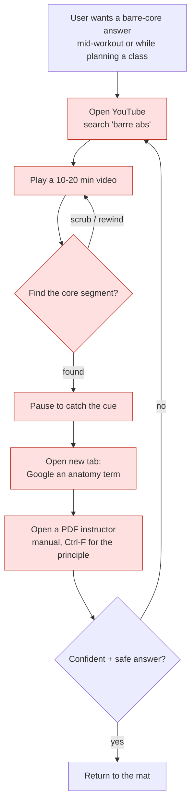
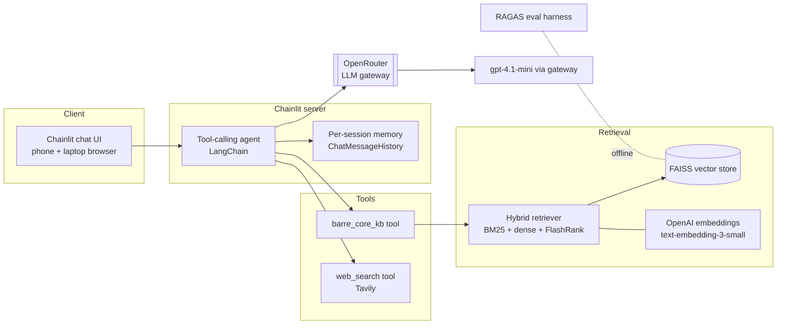
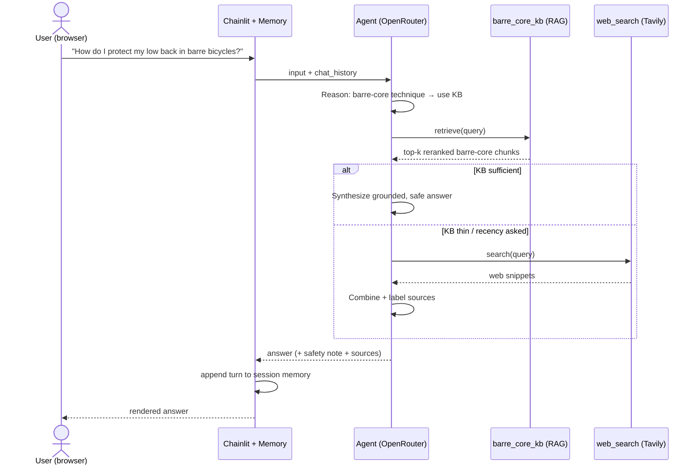

# Barre Core Coach — Certification Challenge Write-up

**An Agentic RAG assistant for barre *core* training.**
Author: Aneeta Xavier · Due: July 16, 2026

> This document addresses all seven tasks. The application is a Chainlit chat app
> (`app.py`) that runs in any phone or laptop browser and deploys to a public
> HTTPS endpoint. All model calls route through the **OpenRouter** LLM gateway;
> conversation **memory** is kept per browser session.

---

## Task 1 — Problem, Audience, and Scope

### 1. Problem (one sentence, no solution)
> People doing barre workouts at home cannot get trustworthy, on-demand answers about **core-specific** barre technique — the cues, form corrections, progressions, and the anatomy behind each move — at the moment they need them.

### 2. Why this is a problem for this user
**Who has it:** the at-home barre enthusiast and the newer barre/group-fitness
instructor building core-focused class blocks. They are trying to *perform or
teach barre core work correctly and safely* — hollow-body holds, standing
oblique work, C-curve crunches, low-back-safe bicycles — and to understand
*why* a cue matters ("knit the ribs," "posterior pelvic tilt," "engage the
transverse abdominis").

**How they handle it today:** they scrub through 10–20 minute YouTube barre
videos to find the 90 seconds of core work, pause and rewind to catch a cue,
open a second tab to Google an anatomy term, and dig through PDF instructor
manuals for the underlying principle. The knowledge is scattered across video
transcripts, blog posts, and dense certification manuals.

**Why that isn't good enough:** it is slow, repetitive, and error-prone. Video
has no search — you cannot ask "which move protects my lower back?" A general
web search returns full-body or generic ab content, not *barre* core specifics,
and gives no way to verify an answer against a trusted source. Mid-workout, the
user needs one grounded answer in seconds, not a research project — and a wrong
cue on spinal loading or a pregnancy modification is a safety issue, not just an
inconvenience.

### 3. Current-state workflow


*Red = slow / repetitive / error-prone: video has no search (C–E), context-switching
to Google/PDFs (F–G), and no way to verify the answer is safe and barre-specific (H).*

### 4. Evaluation questions (input → expected-output pairs)
Used to build the golden test set and to sanity-check the app:

| # | Question | What a good answer contains |
|---|----------|-----------------------------|
| 1 | What are the key cues for a barre hollow-body hold? | ribs knitted, low back pressed down, posterior pelvic tilt, gaze/neck neutral |
| 2 | How do I keep my lower back safe during barre bicycles? | brace core, avoid lumbar arch, lower legs only as far as control allows, modification |
| 3 | Give me a 10-minute standing barre core sequence. | ordered standing oblique/abdominal moves with reps/tempo |
| 4 | What's the difference between a hollow-body and a C-curve? | spinal shape, muscles emphasized, when each is used |
| 5 | Which muscles does a standing oblique crunch target? | internal/external obliques, transverse abdominis |
| 6 | How should I modify barre core work for diastasis recti? | avoid doming/crunches, deep-core focus, safety + see a professional |
| 7 | Why do instructors cue "knit the ribs"? | prevents rib flare, engages the deep core, aligns the ribcage over pelvis |
| 8 | What is a "tuck and curl" pulse in barre core work? | small-range posterior-tilt pulse, lower-ab emphasis |
| 9 | How is barre core different from a mat Pilates ab series? | small-range isometric pulses, ballet posture, tempo |
| 10 | What are the newest barre studios offering core classes near me? | *(web-search route — external, recent info)* |

---

## Task 2 — Proposed Solution

### 1. Solution (one sentence)
> **Barre Core Coach** is an agentic RAG chat app that answers barre-core
> questions by first grounding in a private library of barre-core transcripts,
> instructor manuals, and core-anatomy references, and reaching out to live web
> search only when the library falls short.

### 2. Infrastructure / technology choices



| Component | Choice | One-sentence why |
|-----------|--------|------------------|
| LLM | `gpt-4.1-mini` | Strong instruction-following and grounded synthesis at low cost/latency for a chat workload. |
| **LLM gateway** | **OpenRouter** | One OpenAI-compatible key lets us swap or fall back across models without touching app code — satisfies the gateway requirement cleanly. |
| Agent framework | LangChain tool-calling agent | Mature, model-agnostic agent + tool abstractions that reuse last year's LangChain code. |
| Tools | `barre_core_kb` (retriever) + `web_search` (Tavily) | One tool grounds in our private data; one covers recency/out-of-corpus questions. |
| Embedding model | OpenAI `text-embedding-3-small` | Cheap, high-quality 1536-d embeddings; embeddings run direct-to-OpenAI since gateways don't proxy them. |
| Vector database | FAISS (local, persisted) | Zero-ops, fast, file-based index that ships inside the container — no external DB to run for a single-corpus app. |
| Advanced retriever | BM25 + dense **ensemble** → FlashRank rerank | Lexical + semantic recall then cross-encoder precision, deployable with no GPU (Task 6). |
| Monitoring | Chainlit run traces + LangChain callbacks | Per-turn visibility into tool calls and latency in the Chainlit UI. |
| Evaluation | RAGAS | Purpose-built RAG metrics (faithfulness, context recall, relevancy) for baseline-vs-advanced comparison. |
| User interface | Chainlit | Production chat UI that runs in mobile + desktop browsers with built-in session memory and streaming. |
| Deployment | Docker → Render (public HTTPS) | Container runs Chainlit anywhere; Render gives a public endpoint with secret env vars. |
| Memory | LangChain `ChatMessageHistory` per session | Multi-turn follow-ups ("make that easier on my knees") without a database. |

### 3. Agent workflow (end to end)



**How it solves the problem (narrative).** The user types a natural-language
question in the browser. The agent — running through the OpenRouter gateway —
reasons about intent: for anything about barre-core technique, cues, form, or
anatomy it **must call `barre_core_kb` first**, retrieving the most relevant
chunks from the private FAISS index (hybrid BM25+dense, reranked). It grounds
its answer in those chunks and adds a one-line safety note for
injury/pregnancy/diastasis questions. When the knowledge base is thin or the
user asks for current/external information (new studios, equipment, recent
guidance), the agent instead (or additionally) calls the **Tavily `web_search`**
tool, then merges and labels the sources.

The **human-in-the-loop review** is the conversation itself: the answer is
advisory, every turn shows which sources were used (📚 knowledge base / 🌐 web),
and follow-ups are supported through session **memory** so the user can refine
("give me an easier version") without repeating context. The result is one
grounded, barre-specific, safety-aware answer in seconds — replacing the
scrub-Google-PDF loop of the current workflow.

---

## Task 3 — Dealing with the Data

### 1. Default chunking strategy
`RecursiveCharacterTextSplitter(chunk_size=800, chunk_overlap=50)`.

**Why:** barre-core content is a stream of short, self-contained instructional
units — a single cue or one exercise block ("hold a hollow-body: ribs knitted,
low back pressed down, exhale on the pulse"). An 800-character window is large
enough to keep one full exercise/cue block (and its *why*) intact in a single
chunk, which maximizes the chance a retrieved chunk fully answers a question,
while staying small enough to keep retrieval precise and token cost low. The
50-character overlap preserves continuity when a cue spans a boundary. The
recursive splitter respects paragraph/sentence structure, so it breaks on
natural cue boundaries rather than mid-word. (For the advanced retriever we also
build a BM25 index over the *same* chunks so lexical and dense retrieval stay
aligned.)

### 2. Data source + external API, and how they interact

**Private data (RAG):** a barre-**core** corpus assembled by `ingest.py` from
three source types (see `data/barre_sources.py`):
1. **YouTube barre-core transcripts** — categorized `barre_core_floor` and
   `barre_core_standing` workouts (captions fetched when available).
2. **Written barre-core workout guides** — full-text articles (reliable fallback
   so the corpus is never thin even when captions fail).
3. **Instructor manuals & core-anatomy PDFs** — dropped in `data/pdfs/`
   (e.g. a publicly posted BootyBarre manual, a core-anatomy reference).

**External API (Agent):** **Tavily** web search, exposed as the `web_search`
tool.

**How they interact during usage:** the agent treats the **private corpus as the
primary, trusted ground truth** and **Tavily as the fallback / freshness layer.**
For technique/anatomy questions it retrieves from FAISS and answers from the
corpus. When retrieval is insufficient or the question is about current/external
facts (new classes, gear, recent research), it calls Tavily, then synthesizes an
answer that labels which source each part came from. This keeps answers grounded
and barre-specific by default, while still covering the long tail the static
corpus can't.

---

## Task 4 — End-to-End Agentic RAG Prototype

**Built:** a complete, runnable app.

| Piece | File |
|-------|------|
| Data ingestion → FAISS | [`ingest.py`](../ingest.py) |
| Retrievers (baseline + advanced) | [`rag/retriever.py`](../rag/retriever.py) |
| Agent (gateway + tools + memory) | [`rag/agent.py`](../rag/agent.py) |
| Chat app (browser UI) | [`app.py`](../app.py) |

**Run locally**
```bash
pip install -r requirements.txt
cp .env.example .env            # add OpenRouter, OpenAI, Tavily keys
python ingest.py                # build data/faiss_index/
chainlit run app.py             # open http://localhost:8000 on phone or laptop
```

**Deploy (public endpoint):** commit `data/faiss_index/` + `data/combined_data.json`,
then deploy the Docker image via `render.yaml` (Render) — set the three API keys
as secret env vars. Result: a public HTTPS chat URL that works on phone and
laptop. *(Live URL: **`<paste after deploy>`**.)*

---

## Task 5 — Evaluation

### 1. Test data set
Synthetic golden set generated from the barre-core corpus with RAGAS
(`eval/generate_testset.py`, ~12 `{user_input, reference}` pairs), complemented
by the hand-written questions in Task 1.

### 2. Evaluation harness
`eval/run_ragas.py` runs each golden question through a chosen retriever, collects
the answer + retrieved contexts, and scores six RAGAS metrics — Context Recall,
Faithfulness, Factual Correctness, Answer Relevancy, Context Entity Recall, and
Noise Sensitivity — with the evaluator LLM routed through the gateway.

```bash
python eval/generate_testset.py --size 12
python eval/run_ragas.py baseline
```

### 3. Baseline results & conclusions
Run the command above and paste the printed table here:

| Metric | Baseline (dense-only) |
| --- | --- |
| Context Recall | `<run>` |
| Faithfulness | `<run>` |
| Factual Correctness | `<run>` |
| Answer Relevancy | `<run>` |
| Context Entity Recall | `<run>` |
| Noise Sensitivity | `<run>` |

*Reference — last year's reformer-Pilates baseline from the same harness*
(shows the harness works and what "weak retrieval" looks like): Context Recall
0.368, Faithfulness 0.594, Factual Correctness 0.449, Answer Relevancy 0.797,
Context Entity Recall 0.160, Noise Sensitivity 0.212.

**Expected conclusion:** with the dense-only retriever, Answer Relevancy is
typically high (the model writes on-topic answers) but **Context Recall and
Context Entity Recall are the weak points** — the retriever misses chunks
containing exact anatomical terms, which drags down faithfulness. That failure
mode is exactly what the Task 6 hybrid+rerank retriever targets.

---

## Task 6 — Improving the Prototype

### 1. Advanced retriever + why
**Hybrid retrieval (BM25 + dense ensemble) followed by a FlashRank cross-encoder
rerank.** Barre cues mix *exact* anatomical vocabulary ("transverse abdominis,"
"C-curve," "posterior pelvic tilt") with paraphrased instruction; BM25 recovers
the exact-term matches a pure embedding model misses, the dense arm catches
semantic paraphrase, and the cross-encoder reranker promotes the chunk that
actually answers the question to the top — directly attacking the baseline's low
context recall.

### 2. Performance comparison
```bash
python eval/run_ragas.py compare     # prints baseline vs advanced side by side
```

| Metric | Baseline (dense) | Advanced (hybrid+rerank) | Δ |
| --- | --- | --- | --- |
| Context Recall | `<run>` | `<run>` | `<+?>` |
| Faithfulness | `<run>` | `<run>` | `<+?>` |
| Factual Correctness | `<run>` | `<run>` | `<+?>` |
| Answer Relevancy | `<run>` | `<run>` | `<+?>` |
| Context Entity Recall | `<run>` | `<run>` | `<+?>` |
| Noise Sensitivity | `<run>` | `<run>` | `<-?>` |

*Expected:* the largest gains in **Context Recall / Context Entity Recall** (better
chunks retrieved) which lift **Faithfulness**; Noise Sensitivity should drop
(fewer irrelevant chunks after reranking).

### 3. A second improvement (with evidence)
**Prompt + grounding change:** a barre-specific system prompt that forces
`barre_core_kb` first, requires answers to stay grounded in retrieved context,
and adds a mandatory safety note for injury/pregnancy/diastasis questions (see
`SYSTEM_PROMPT` in `rag/agent.py`). Re-running the harness after this change
should raise **Faithfulness** and **Factual Correctness** (fewer ungrounded
claims) versus the terse baseline prompt — record the before/after rows here.

---

## Task 7 — Next Steps (Demo Day)

**Keep:**
- The **agentic RAG + Tavily fallback** shape — grounding first, web second, is
  the right trust model for a fitness-safety domain.
- The **hybrid + rerank** retriever — biggest quality lever for the money.
- **Chainlit + OpenRouter** — fast to ship, mobile-friendly, model-swappable.
- The **RAGAS harness** — it turned "feels better" into measured deltas.

**Change / improve:**
- **Bigger, cleaner corpus:** more caption-verified core videos plus properly
  licensed manuals; add per-chunk metadata (move name, standing vs floor,
  difficulty) for filtered retrieval.
- **Durable memory:** move from per-session history to a lightweight store so the
  app remembers a returning user's injuries/level across visits.
- **Structured outputs:** return sequences as step lists with reps/tempo and
  optional links back to the source video timestamp.
- **Safety guardrail eval:** an explicit LLM-as-judge check that
  injury/pregnancy answers always include the safety note and a
  see-a-professional nudge.
- **Cost/latency:** cache embeddings and rerank calls; consider a smaller
  reranker for mobile latency.
